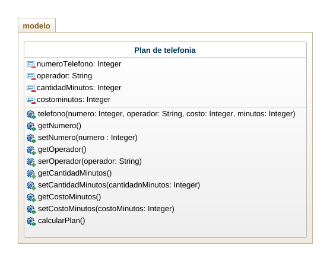

## Ejercicio
Crear un programa para gestionar un plan de telefonia celular, el plan tiene un número de celular, un operador, una cantidad de minutos y un costo por minutos, calcular el total a pagar teniendo en cuenta que si el operador es movilujo tiene un 50% de descuento. Usar minimo 3 constructores

## Analisis
- Para crear un plan de telefonia se necesitarian los siguientes datos:
  - Numero telefono
  - Operador
  - Cantidad de minutos

ya para calcular el precio del plan se crea una variable double que me permita calcular y saber el precio, incluyendo si es movilujo para que tenga su respectivo descuento.

## Diagrama de clase
